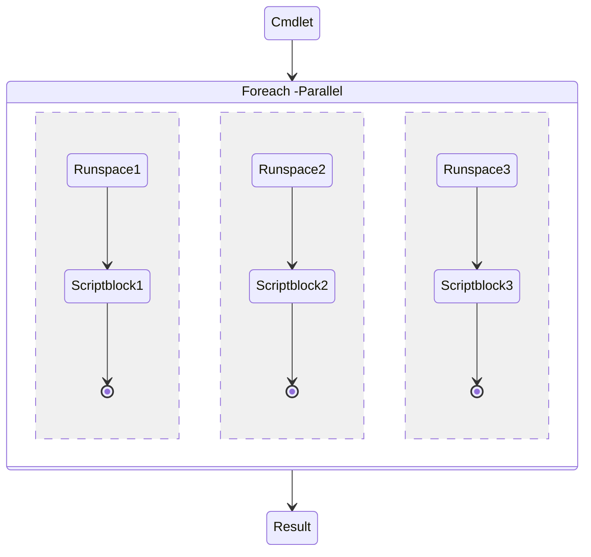

# PowerShell Basics

- [PowerShell Basics](#powershell-basics)
  - [Basics](#basics)
  - [Versions](#versions)
  - [First Steps](#first-steps)
  - [Basic Concepts](#basic-concepts)
  - [Aliases](#aliases)
  - [Variables](#variables)
  - [Input / Output](#input--output)
  - [Object Based](#object-based)
  - [Pipeline](#pipeline)
  - [Pipeline Where Object](#pipeline-where-object)
  - [Pipeline Foreach Object](#pipeline-foreach-object)
  - [Pipeline Select Object](#pipeline-select-object)
  - [Types](#types)
  - [Modules](#modules)
  - [Highlights](#highlights)
  - [Features from other Shells](#features-from-other-shells)
  - [Available Modules](#available-modules)
  - [Cmdlets / functions](#cmdlets--functions)
  - [Variables](#variables-1)
  - [Finding the right command](#finding-the-right-command)
  - [Keyboard Shortcuts](#keyboard-shortcuts)
  - [PowerShell repo](#powershell-repo)
  - [Notes](#notes)
  - [Links](#links)
  - [Literature](#literature)

## Basics
What is PowerShell?

Automation Framework!
## Versions
* Windows PowerShell 1.0\
Released 2006
* Windows PowerShell 2.0\
Added Remoting
* Windows PowerShell 3.0\
Automatic Module detection
* Windows PowerShell 4.0\
Added Desired State Configuration „DSC“
* Windows PowerShell 5.0\
Just enough Administration „JEA“
Windows PowerShell 5.1 – Windows
* PowerShell Core 6\
First time Multiplatform
* PowerShell 7.1 – Multiplatform
## First Steps
First Steps
## Basic Concepts
- ```Verb-Noun``` Cmdlets
- Case insensitive
- Basic Concepts
- Object based
- Autotype Casting
- Basic Concepts
- .NET Based
## Aliases
Common Unix / dos commands built-in
|Alias|Cmdlet|
|---|---|
|```ls```|```Get-Childitems```|
|```curl```|```Invoke-WebRequest```|
|```mkdir```|```New-Item –ItemType Directory```|
Built-In Aliases
|```%```|```For-Each```
|```?```|```Where-Object```
|```$_```|```$PSITEM```


[](https://asciinema.org/a/NnF8Ibw1rRYfBZGfbUb358f8L)


[about Aliases - PowerShell | Microsoft Docs](https://docs.microsoft.com/en-us/powershell/module/microsoft.powershell.core/about/about_aliases?view=powershell-7.1)
## Variables
DEMO TIME
## Input / Output
|Input||
|---|---|
|Parameters|
|Pipeline|Takes data from previous cmdlets pipeline
|Read-Host|Prompts the user for interactive input
|Write-Output|
|Write-Debug/Error/Warning/Information|Levels of verbosity
## Object Based
Each PSObject has:
- Type
- Properties
- Methods
## Pipeline
Chains commands together
Data from the previous command available in ```$PSITEM``` / ```$_```

[about Pipelines - PowerShell | Microsoft Docs](https://docs.microsoft.com/en-us/powershell/module/microsoft.powershell.core/about/about_pipelines?view=powershell-7.1)
## Pipeline Where Object
Filter Objects by properties
Common Operators:\
```-eq``` /``` -ne```\
```-like``` / ```-notlike```\
```-gt``` / ```-lt```

[about Operators - PowerShell | Microsoft Docs](https://docs.microsoft.com/en-us/powershell/module/microsoft.powershell.core/about/about_operators?view=powershell-7.1)

## Pipeline Foreach Object
Runs script block for every object in Pipeline
## Pipeline Select Object
Filters the properties which are output
Alias Select
## Types
## Modules
Binary Modules
Script Modules
[about Operators - PowerShell | Microsoft Docs](https://docs.microsoft.com/en-us/powershell/module/microsoft.powershell.core/about/about_modules?view=powershell-7.1)
Modules
Get-InstalledModule Lists installed Modules (not currently loaded!)
Get-Module Lists currently loaded modules
## Highlights
- Import / Export Objects\
All object in PowerShell can be exported and imported again in a deserialzied state

- Credential Objects\
PowerShell provides credential objects for securely handle secrets

- Built-in Debugging\
There is full debugging(e.g. breakpoint, stepping through) available in PowerShell

- Execution Policies\
Prevention of accidental execution

- Out-GridView
- Splatting\
Parameter can be passed a hashtable improving readabilty in scripts (don't use ``` ` ``` !)
- Foreach –Parallel\
Since PowerShell 7 parallel execution of piped inputs can be performed, racecondtion aware datatypes are available as well

- PowerShell Remoting\
Execute commands on remote host interactivly or unattended
- Logging / Auditing\
PowerShell provides logging and auditing features out of the box
## Features from other Shells
History / Search
Profile
Aliases
Pipelines
Man
## Available Modules
Official Supported
- (All most) Everything Microsoft
- VMWare
- NetApp
PowerShell Gallery | Home
artifactory.imp.ac.at - POSH
- 1Password
- Cisco ISE
## Cmdlets / functions
AKA “Commands”
VERB – NOUN nomenclature
E.g. Start-Process
Get-Command -Verb Get -Noun *event*
Get-Verb – Lists naming recommendations
Common parameters
- Verbose
- Whatif
DEMO TIME
## Variables
|Variable Name|Description|
|---|---|
```$?```|Last exit code
```$Error```|Contains all errors from this session
```$PSVersionTable```|PowerShell Version
```$PSItem```|Current item in Pipeline
```$true``` / ```$false``` / ```$null```|
```$PROFILE```|Path to the user PowerShell profile

[about Automatic Variables - PowerShell | Microsoft Docs](https://docs.microsoft.com/en-us/powershell/module/microsoft.powershell.core/about/about_automatic_variables?view=powershell-7.2)
## Finding the right command
- ```Get-Command``` aka ```gcm```
- ```Get-Members``` aka ```gm```
- ```Get-help aka ```help```
- ```Show-Command```

## Keyboard Shortcuts
Autocomplete with ```CTRL``` + ```SPACE```
Works on Cmdlets and parameters
## PowerShell repo
https://bitbucket.vbc.ac.at/projects/VBCOPS/repos/scriptsandsnippets/browse
## Notes
Set-ExecutionPolicy -ExecutionPolicy Unrestricted -Scope CurrentUser Sets executionpolicy to unrestricted for current user
## Links
[PowerShell best pratice](https://poshcode.gitbook.io/powershell-practice-and-style)\
[Adam the automator](https://adamtheautomator.com/)\
about Profiles - PowerShell | Microsoft Docs
## Literature
|Title|Author|
|---|---|
|Windows PowerShell|Tobias Weltner
|Learn Windows PowerShell in a month of lunches|Don Jones
|PowerShell Cookbook|Lee Holmes
